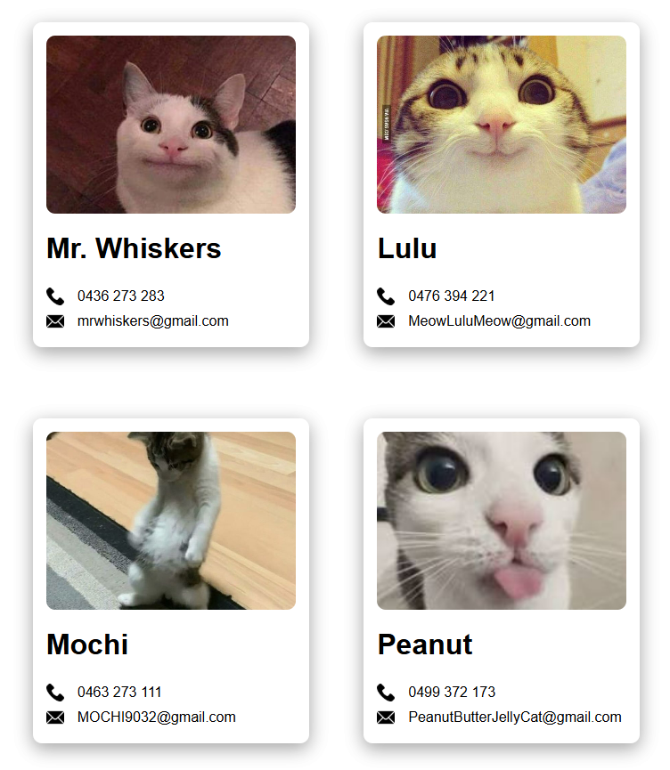

# 🐱 Cat Directory

This is a basic React project I created by following the [Scrimba React tutorial](https://www.youtube.com/watch?v=x4rFhThSX04). It displays a directory of adorable cats with their contact details.

## 🛠 My Demo



## 🛠️ What I Learned

While building this project, I learned about:

- **React Components** – Structuring the UI into smaller, reusable components.
- **JSX** – Using JavaScript inside HTML-like syntax to render dynamic content.
- **Props** – Passing data (like cat names, images, phone numbers, and emails) into components using props.

Each cat profile is represented using a `ContactCard` component, and the following props are passed to it:

```js
<ContactCard
  img="cat-image-url.jpg"
  name="Mr. Whiskers"
  phone="0436 273 283"
  email="mrwhiskers@gmail.com"
/>
```

This project helped me understand the foundational building blocks of React and how to reuse a component with different content by changing its props.

## 🛠 How to Run Locally

1. Clone the repo
2. Navigate into the folder
3. Install dependencies
   `npm install`
4. Start the dev server
   `npm run dev`

> This project uses [Vite](https://vitejs.dev/) for fast setup and hot reloading.
